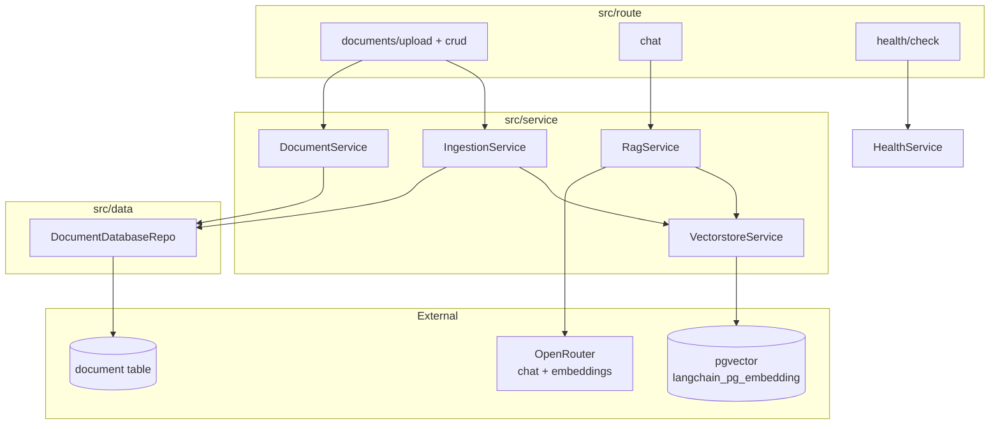

# TinyRAG

A small, production-shaped **Retrieval-Augmented Generation (RAG)** service built with
**FastAPI**, **LangChain**, and **pgvector**. Upload documents, have them chunked and
embedded into Postgres, then chat with an LLM that answers grounded in your own files.

---

## About

TinyRAG is a self-contained REST API for document-grounded chat:

- **Document ingestion** — upload PDF, DOCX, TXT, or Markdown files. Each file is parsed,
  split into overlapping chunks, embedded, and stored in a `pgvector` collection.
- **RAG chat** — ask a question and get an answer synthesized from the most relevant
  chunks, along with the source passages it drew from.
- **Provider-agnostic LLM** — talks to any OpenAI-compatible endpoint. The repo ships
  configured for [OpenRouter](https://openrouter.ai), so you can swap chat/embedding
  models with a single env var.

It deliberately stays *tiny*: no auth, no streaming, no background queue — just the core
ingest → embed → retrieve → answer loop, structured cleanly enough to grow into more.

### Tech stack

| Concern        | Choice |
|----------------|--------|
| Web framework  | FastAPI (`0.136`) |
| RAG toolkit    | LangChain (`langchain`, `langchain-openai`, `langchain-postgres`) |
| Vector store   | `pgvector` (`pgvector/pgvector:pg18`) via `langchain_postgres.PGVector` |
| Document registry | Tortoise ORM (`asyncpg`) — owns the `document` table only |
| LLM gateway    | OpenRouter (OpenAI-compatible) |
| Parsers        | `pypdf`, `docx2txt` |
| Tooling        | `uv`, `ruff`, `loguru`, Docker Compose |
| Python         | `>=3.14.3` |

---

## Purpose

The project exists to be a **clear, minimal reference implementation** of a RAG service
with clean layering — small enough to read end-to-end, complete enough to actually run.

It demonstrates:

- A clean **route → service → repo → model** layering with a typed `Success` / `Error`
  response envelope.
- Splitting responsibilities between **LangChain** (owns the vector tables /
  `langchain_pg_embedding`) and **Tortoise ORM** (owns the `document` registry).
- Swapping LLM and embedding models purely through configuration.
- Wiring `pgvector` into Postgres with native Tortoise migrations.

Use it as a starting point for your own RAG backend, or as a learning sample for how the
pieces fit together.

---

## Architecture



**Layering:** `route` (thin HTTP) → `service` (business logic, raises `Error`) →
`repo` (DB access) → `data/db/model`. LangChain owns the vector tables; Tortoise owns the
`document` registry only.

```
src/
├── main.py                  # create_app(): settings → CORS → errors → routers → db
├── config/                  # pydantic settings, get_settings()
├── core/                    # Base model, Error/Success envelope, enums, helpers
├── data/
│   ├── db/                  # Tortoise DB_CONFIG, init_db, migrations
│   ├── repo/                # DocumentDatabaseRepo
│   ├── schema/              # request/response pydantic schemas (chat, document, health)
│   └── type/                # Env / LlmProvider enums
├── lib/
│   ├── document_loader.py   # route file by extension → LangChain loader
│   └── llm_factory.py       # build chat model + embeddings from settings
├── route/                   # health, document (upload/crud), chat subrouters
├── service/                 # ingestion, rag, document, vectorstore, health
└── scripts/migrate.py       # run Tortoise migrations
```

---

## Setup

### Prerequisites

- [`uv`](https://docs.astral.sh/uv/) (Python package/runner)
- Docker + Docker Compose (for the `pgvector` database)
- An [OpenRouter](https://openrouter.ai) API key (or any OpenAI-compatible endpoint)

### 1. Configure environment

```bash
cp .env.example .env
```

Edit `.env` and set your key:

```dotenv
# core
ENV=local
DEBUG=true

# db   (host "db" works inside Docker; use "localhost" when running on the host)
DB_SCHEMA=postgresql
DB_HOST=db
DB_PORT=5432
DB_USER=user
DB_PASSWORD=password
DB_NAME=tinyrag

# llm  (OpenRouter — OpenAI-compatible gateway)
OPENROUTER_API_KEY=sk-or-...
OPENROUTER_BASE_URL=https://openrouter.ai/api/v1
OPENROUTER_CHAT_MODEL=openai/gpt-4o-mini
OPENROUTER_EMBEDDING_MODEL=nvidia/llama-nemotron-embed-vl-1b-v2:free

# rag
CHUNK_SIZE=1000
CHUNK_OVERLAP=200
RETRIEVAL_TOP_K=4
COLLECTION_NAME=tinyrag
MAX_UPLOAD_BYTES=20971520

# cors: comma-separated origins; empty = same-origin only
CORS_ORIGINS=
```

### 2. Run with Docker (recommended)

Brings up `pgvector`, runs migrations, and starts the API with reload:

```bash
make up        # docker compose up -d  (db + server)
make logs      # follow logs
```

The server container runs migrations automatically on start. API is then live at
**http://localhost:8000**.

### 3. Or run the app on the host

Start only the database in Docker, run the app locally with `uv`:

```bash
make up               # start pgvector (set DB_HOST=localhost in .env for this)
make install          # uv sync
make migrate          # apply Tortoise migrations + enable vector extension
make run              # ruff check --fix, then uvicorn with reload
```

### Useful make targets

| Command        | What it does |
|----------------|--------------|
| `make up`      | `docker compose up -d` (db + server) |
| `make down`    | Stop and remove containers |
| `make clean-db`| Tear down containers **and volumes** (wipes data) |
| `make install` | `uv sync` |
| `make migrate` | Run Tortoise migrations (`src.scripts.migrate`) |
| `make run`     | Lint + run uvicorn with `--reload` |
| `make check`   | `uv sync` + `ruff check --fix` |
| `make logs`    | Follow compose logs |

Interactive OpenAPI docs: **http://localhost:8000/docs**

---

## API & high-level examples

All responses are wrapped in a typed `Success` envelope; errors come back through a shared
`Error` handler.

| Method   | Path                       | Description |
|----------|----------------------------|-------------|
| `GET`    | `/health/check`            | App, database, and LLM provider health |
| `POST`   | `/documents/upload`        | Upload PDF/DOCX/TXT/MD; chunk and embed |
| `GET`    | `/documents`               | List uploaded documents |
| `DELETE` | `/documents/{document_id}` | Soft-delete a document and remove its vectors |
| `POST`   | `/chat`                    | RAG chat over uploaded documents |

### Health check

```bash
curl http://localhost:8000/health/check
```

### Upload a document

```bash
curl -X POST http://localhost:8000/documents/upload \
  -F "file=@./report.pdf"
```

The file is parsed by extension, split into `CHUNK_SIZE`/`CHUNK_OVERLAP` chunks, embedded
via the configured embedding model, and stored in the `pgvector` collection. A `document`
row records the filename, content type, size, and chunk count.

### List documents

```bash
curl http://localhost:8000/documents
```

### Chat over your documents

```bash
curl -X POST http://localhost:8000/chat \
  -H "Content-Type: application/json" \
  -d '{
    "message": "What is this document about?",
    "document_ids": null
  }'
```

`document_ids` is optional — pass a list of UUIDs to restrict retrieval to specific
documents, or `null` to search across everything.

**Response** (inside the `Success` envelope):

```json
{
  "answer": "The document describes ...",
  "sources": [
    {
      "document_id": "…",
      "filename": "report.pdf",
      "chunk_index": 0,
      "snippet": "…"
    }
  ]
}
```

### Delete a document

```bash
curl -X DELETE http://localhost:8000/documents/<document_id>
```

Soft-deletes the registry row and removes the associated vectors from `pgvector`.

---

## How it works

1. **Upload** → `IngestionService` validates the file, `document_loader` parses it by
   extension, a text splitter chunks it, `llm_factory` produces embeddings, and
   `VectorstoreService` writes them to `pgvector` with a `document_id` in metadata. A
   `Document` row is created via `DocumentDatabaseRepo`.
2. **Chat** → `RagService` builds a retriever (optionally filtered by `document_ids`),
   pulls the top-`RETRIEVAL_TOP_K` chunks, feeds them to the chat model through a LangChain
   chain, and returns the answer plus its source chunks.
3. **Delete** → `DocumentService` soft-deletes the registry row and clears matching vectors
   from `langchain_pg_embedding`.

---

## Notes & scope

- **Provider:** Configured for OpenRouter, but `OPENROUTER_BASE_URL` accepts any
  OpenAI-compatible endpoint. Swap chat/embedding models via the `OPENROUTER_*_MODEL`
  vars. Embeddings must return float vectors — see the project memory on OpenRouter
  embedding gotchas if you hit `"No embedding data received"`.
- **Vector vs. registry tables:** LangChain manages `langchain_pg_embedding` /
  `langchain_pg_collection`; Tortoise manages only the `document` table.
- **Out of scope (v1):** authentication, streaming responses, conversation memory, and a
  background ingestion queue.

See [`docs/api.md`](docs/api.md) for endpoint detail and [`docs/plan.md`](docs/plan.md)
for the full design rationale.
