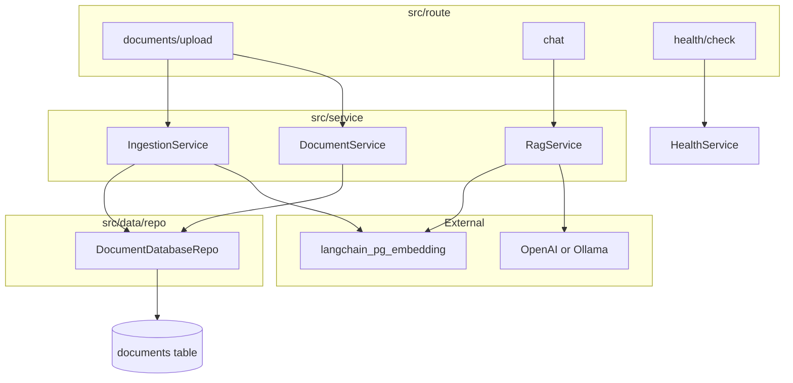

# FastAPI + LangChain + pgvector RAG

## Context

- **Repo**: [tinyrag](https://github.com/iamromandev/tinyrag) (greenfield)
- **Reference project**: [`/Users/roman/projects/github/auth`](/Users/roman/projects/github/auth) — follow its **directory layout, layering, and dev tooling**; add LangChain/pgvector on top
- **Features**: document upload → embed in pgvector; RAG chat over uploaded docs
- **Providers**: OpenAI or Ollama (env-configurable)
- **Formats**: PDF, DOCX, plain text / Markdown

## Architecture



**Layering (same as auth)**: `route` (thin) → `service` (business logic, raises `Error`) → `repo` (DB) → `data/db/model`.

LangChain owns vector tables; Tortoise owns the `documents` registry only.

---

## Project layout (mirror auth)

Reference: auth tree at `src/` with `config/`, `core/`, `data/`, `route/`, `service/`, `lib/`, `deps/`.

```
tinyrag/
├── src/
│   ├── main.py                      # create_app(), init_global_errors, init_db, include routers
│   ├── config/
│   │   ├── __init__.py              # re-export Settings, get_settings
│   │   └── config.py                # pydantic-settings (like auth)
│   ├── core/
│   │   ├── base.py                  # Base model, BaseRepo, BaseService, BaseSchema (copy pattern)
│   │   ├── common.py                # serialize(), get_app_version()
│   │   ├── constant.py              # Tortoise exception → Code maps
│   │   ├── error.py                 # Error + init_global_errors()
│   │   ├── success.py               # Success[T] envelope + to_resp()
│   │   └── type.py                  # Status, ErrorType, Code enums
│   ├── data/
│   │   ├── db/
│   │   │   ├── __init__.py          # DB_CONFIG, init_db, run_migration, get_db_health
│   │   │   ├── model/
│   │   │   │   ├── __init__.py
│   │   │   │   └── document.py      # Document(Base)
│   │   │   └── migration/
│   │   │       └── 0001_initial.py  # documents + CREATE EXTENSION vector
│   │   ├── repo/
│   │   │   ├── interface/document.py
│   │   │   └── document_db.py       # DocumentDatabaseRepo(BaseRepo)
│   │   ├── schema/
│   │   │   ├── document.py          # UploadResponse, DocumentListItem, ...
│   │   │   ├── chat.py
│   │   │   └── health.py
│   │   └── type/
│   │       ├── core.py              # Env StrEnum
│   │       └── llm.py               # LlmProvider StrEnum
│   ├── lib/
│   │   ├── document_loader.py       # PDF/DOCX/txt by extension
│   │   └── llm_factory.py           # get_embeddings(), get_chat_model()
│   ├── route/
│   │   ├── __init__.py              # aggregate subrouters
│   │   ├── health/
│   │   │   ├── __init__.py
│   │   │   └── health.py            # GET /check → Success[HealthSchema]
│   │   ├── documents/
│   │   │   ├── __init__.py
│   │   │   ├── upload.py
│   │   │   └── crud.py              # list, delete
│   │   └── chat/
│   │       ├── __init__.py
│   │       └── chat.py              # POST /
│   └── service/
│       ├── __init__.py              # get_*_service() DI factories
│       ├── health/
│       ├── document_service.py
│       ├── ingestion_service.py
│       ├── rag_service.py
│       └── vectorstore_service.py   # PGVector singleton/lazy init
├── docs/
│   ├── api.md                       # endpoint notes
│   └── plan.md                      # this file
├── docker-compose.yml
├── dockerfile                       # multi-stage uv build (copy auth pattern)
├── makefile                         # make install, up, run, check
├── pyproject.toml
├── uv.lock
├── .env.example
└── .gitignore
```

**Not used** (differs from earlier tinyrag draft): `app/`, Aerich, Alembic, standalone `logging.py`.

---

## Patterns copied from auth

| Pattern | Auth reference | tinyrag usage |
|---------|------------------|---------------|
| `create_app()` factory | [`auth/src/main.py`](/Users/roman/projects/github/auth/src/main.py) | Same wiring order: settings → FastAPI → CORS → `init_global_errors` → routers → `init_db` |
| Tortoise via `register_tortoise` | [`auth/src/data/db/__init__.py`](/Users/roman/projects/github/auth/src/data/db/__init__.py) | `init_db(app)` at app build time (not inside lifespan) |
| Native migrations (no Aerich) | `tortoise.migrations.api.migrate` + `src/data/db/migration/` | `0001_initial.py` for `documents` + `CREATE EXTENSION vector` |
| `[tool.tortoise]` | auth `pyproject.toml` | `tortoise_orm = "src.data.db.DB_CONFIG"` |
| Settings | [`auth/src/config/config.py`](/Users/roman/projects/github/auth/src/config/config.py) | `BaseSettings`, `SecretStr`, `@lru_cache get_settings()`, split `DB_*` fields |
| Success/Error API | [`auth/src/core/success.py`](/Users/roman/projects/github/auth/src/core/success.py), [`error.py`](/Users/roman/projects/github/auth/src/core/error.py) | Routes return `Success.ok(data=...).to_resp()`; services raise `Error.not_found()` etc. |
| Router aggregation | [`auth/src/route/__init__.py`](/Users/roman/projects/github/auth/src/route/__init__.py) | `_subrouters` list + `for subrouter in _subrouters: router.include_router(subrouter)` |
| Service DI | [`auth/src/service/__init__.py`](/Users/roman/projects/github/auth/src/service/__init__.py) | `async def get_ingestion_service() -> AsyncGenerator[...]: yield ...` |
| Repo interface + impl | `data/repo/interface/` + `*_db.py` | `DocumentRepo` ABC + `DocumentDatabaseRepo` |
| loguru | ad hoc `from loguru import logger` | Same; tag logs via `BaseService._tag` where applicable |
| Dev workflow | [`auth/makefile`](/Users/roman/projects/github/auth/makefile) | `make install`, `make up`, `make run` (lint + uvicorn) |
| Docker | [`auth/docker-compose.yml`](/Users/roman/projects/github/auth/docker-compose.yml) | `db` + `server` services; **db image = pgvector** for tinyrag |

---

## `src/main.py` (auth-style)

```python
def create_app() -> FastAPI:
    settings = get_settings()
    app = FastAPI(title="TinyRAG", version=get_app_version(), debug=settings.debug, lifespan=lifespan)
    if settings.cors_origin_list:
        app.add_middleware(CORSMiddleware, ...)
    init_global_errors(app)
    for router in [_router]:
        app.include_router(router)
    init_db(app)  # register_tortoise — must be here, not in lifespan
    return app

app = create_app()

def run() -> None:
    uvicorn.run("src.main:app", host="0.0.0.0", port=8000, loop="uvloop")
```

---

## Configuration — `src/config/config.py`

Match auth field style (`DB_HOST`, `DB_PORT`, …) plus RAG-specific settings:

```python
# core
env: Env
debug: bool
cors_origins: str = ""

# db (same shape as auth)
db_host, db_port, db_name, db_user, db_password: SecretStr

# llm
llm_provider: LlmProvider = LlmProvider.openai
embedding_provider: LlmProvider | None = None  # default → llm_provider
openai_api_key: SecretStr | None
ollama_base_url: str = "http://localhost:11434"
openai_chat_model, openai_embedding_model, ollama_chat_model, ollama_embedding_model

# rag
chunk_size: int = 1000
chunk_overlap: int = 200
retrieval_top_k: int = 4
collection_name: str = "tinyrag"
max_upload_bytes: int = 20 * 1024 * 1024

@property
def cors_origin_list(self) -> list[str]: ...
@property
def langchain_database_url(self) -> str:
    # build postgresql+psycopg:// from db_* + serialize(db_password)
```

Re-export in `src/config/__init__.py`: `Settings`, `get_settings`, `settings`.

---

## Database

### Tortoise — `src/data/db/__init__.py`

Same `DB_CONFIG` structure as auth:

```python
DB_CONFIG = {
    "connections": {"default": {"engine": "tortoise.backends.asyncpg", "credentials": {...}}},
    "apps": {
        "model": {
            "models": ["src.data.db.model"],
            "default_connection": "default",
            "migrations": "src.data.db.migration",
        },
    },
}
```

`init_db(app)` → `register_tortoise(app, config=DB_CONFIG, generate_schemas=False, add_exception_handlers=True)`.

`run_migration()` — copy auth’s `migrate(config=DB_CONFIG, progress=...)` helper; invoke via `make migrate` or documented `uv run` one-liner.

### Model — `src/data/db/model/document.py`

Extend auth’s `Base` (UUID PK, `created_at`/`updated_at`/`deleted_at`, `get_active()`):

```python
class Document(Base):
    filename = fields.CharField(max_length=512)
    content_type = fields.CharField(max_length=128)
    size_bytes = fields.IntField()
    chunk_count = fields.IntField(default=0)

    class Meta:
        table = "document"
```

### Migration `0001_initial.py`

- `CREATE EXTENSION IF NOT EXISTS vector;`
- Create `documents` table matching model

### LangChain pgvector

`src/service/vectorstore_service.py` wraps `langchain_postgres.PGVector`:

- `connection=settings.langchain_database_url`
- `use_jsonb=True` for `document_id` metadata filters
- Delete vectors on document delete: SQL `DELETE FROM langchain_pg_embedding WHERE cmetadata->>'document_id' = $1` via Tortoise connection or LangChain API

---

## API endpoints

| Method | Path | Handler | Response |
|--------|------|---------|----------|
| `GET` | `/health/check` | `route/health/health.py` | `Success[HealthSchema]` (db + ollama optional) |
| `POST` | `/documents/upload` | `route/documents/upload.py` | `Success[UploadResponse]` |
| `GET` | `/documents` | `route/documents/crud.py` | `Success[list[DocumentSchema]]` |
| `DELETE` | `/documents/{id}` | `route/documents/crud.py` | `Success` or 404 via `Error` |
| `POST` | `/chat` | `route/chat/chat.py` | `Success[ChatResponse]` (`answer`, `sources`) |

Route prefixes via subrouter `APIRouter(prefix="/documents")`, `prefix="/chat"` — same idiom as auth’s `/auth`, `/health`.

**Chat body** (`src/data/schema/chat.py`):

```python
class ChatRequest(BaseSchema):
    message: str
    document_ids: list[UUID] | None = None
```

---

## Services

| Service | Responsibility |
|---------|----------------|
| `HealthService` | `get_db_health()`, optional Ollama ping via httpx |
| `DocumentService` | list/get/delete via repo; orchestrate vector cleanup |
| `IngestionService` | validate file → `lib/document_loader` → chunk → embed → PGVector + create `Document` row |
| `RagService` | retriever with metadata filter → LCEL chain → `ChatResponse` |
| `VectorstoreService` | lazy `PGVector` instance, shared by ingestion + rag |

Services extend `BaseService`, use `Error.bad_request()` / `Error.not_found()`, log with `logger.info(f"{self._tag}|ingest(): ...")`.

---

## Key dependencies — `pyproject.toml`

Mirror auth style (`requires-python = ">=3.14.3"`, grouped deps, `[dependency-groups] dev`, `[tool.tortoise]`):

```toml
[project]
name = "tinyrag"
requires-python = ">=3.14.3"
dependencies = [
    ### core ###
    "toml==0.10.2",
    "loguru==0.7.3",
    "fastapi[all]==0.136.1",
    ### db ###
    "tortoise-orm[asyncpg,accel]==1.1.7",
    ### rag ###
    "langchain-core",
    "langchain-community",
    "langchain-openai",
    "langchain-ollama",
    "langchain-postgres",
    "psycopg[binary]",
    ### parsers ###
    "pypdf",
    "docx2txt",
    "python-multipart",
    ### others ###
    "httpx==0.28.1",
]

[dependency-groups]
dev = ["pre-commit", "ruff", "ty"]

[tool.tortoise]
tortoise_orm = "src.data.db.DB_CONFIG"
```

Pin exact versions during implementation to match auth’s pinning habit.

---

## Docker & env

### `docker-compose.yml`

Same structure as auth (`db` + `server`, healthcheck, named networks/volumes):

- **db**: `pgvector/pgvector:pg18` (not plain postgres), port from `.env` (e.g. `5401:5432` to avoid clashing with auth’s `5400`)
- **server**: build `dockerfile` target `local`, mount `.:/workdir`, `uvicorn src.main:app --reload --loop uvloop`
- Init script or first migration enables `vector` extension

### `.env.example`

Grouped comments like auth:

```
# core
ENV=local
DEBUG=true
# db
DB_HOST=localhost
DB_PORT=5432
...
# llm
LLM_PROVIDER=openai
OPENAI_API_KEY=
OLLAMA_BASE_URL=http://localhost:11434
# rag
CHUNK_SIZE=1000
COLLECTION_NAME=tinyrag
# cors
CORS_ORIGINS=
```

---

## Dev workflow (auth makefile)

```bash
cp .env.example .env
make install          # uv sync
make up               # docker compose up -d (pgvector)
make migrate          # tortoise migrations + vector extension
make run              # ruff + uvicorn src.main:app --reload --loop uvloop
```

Ollama (host): `ollama pull llama3.2` + `ollama pull nomic-embed-text`.

OpenAPI: http://localhost:8000/docs

---

## lib/ (tinyrag-specific, auth has similar)

- `src/lib/document_loader.py` — route by extension to LangChain loaders (`PyPDFLoader`, `Docx2txtLoader`, `TextLoader`)
- `src/lib/llm_factory.py` — provider switch using `settings.llm_provider` / `embedding_provider`

---

## Out of scope for v1

- Auth/JWT (no `src/deps/auth.py` unless later)
- Streaming chat, conversation memory, Celery ingest queue
- Tests (auth also has none; optional `pytest` later)

---

## Implementation order

1. **Scaffold** — copy structural skeleton from auth: `pyproject.toml`, `makefile`, `dockerfile`, `docker-compose.yml`, `.env.example`, `.gitignore`, `src/main.py`, `src/config/`, `src/core/` (base, error, success, common, type, constant)
2. **DB layer** — `src/data/db/` + `Document` model + `0001_initial` migration + `DocumentDatabaseRepo` + repo interface
3. **LLM + vector** — `src/lib/llm_factory.py`, `src/service/vectorstore_service.py`, settings properties
4. **Documents API** — `IngestionService`, `DocumentService`, `route/documents/*`, schemas
5. **Chat API** — `RagService`, `route/chat/chat.py`
6. **Health + docs** — `HealthService`, `route/health/`, `docs/api.md`, makefile `migrate` target
